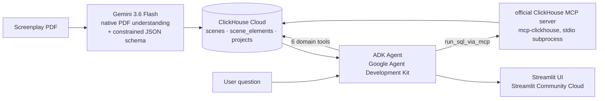

# 🎬 The AD Room — an agentic First Assistant Director

**Agentic Cinema: The Blockbuster Hackathon — ClickHouse track**

**Live demo:** [adroom.streamlit.app](https://adroom.streamlit.app/)

Breaking down a feature screenplay is a real job that takes a First AD two to
four days. You read all 110 pages, log every scene's cast, props, vehicles,
stunts and VFX, group the scenes by set so the crew lights and moves once, then
build a schedule that respects night turnaround and child labour hours.

The AD Room does that breakdown in minutes, stores it as queryable production
data in ClickHouse, and then acts as a crew member you can interrogate:
*"which scenes need the Chevelle, and can we shoot them together?"*

---

## Architecture



**On the Gemini endpoint.** The agent is built on the Google Agent Development
Kit, the Agent Builder toolkit. The ADK is pointed at the Google AI Studio
Gemini endpoint rather than Vertex AI, which keeps the whole project runnable on
free tiers with no billing account. Switching to Vertex is a two-line change in
`src/config.py` — set `GOOGLE_GENAI_USE_VERTEXAI=TRUE` and supply a project ID.

**Why ClickHouse and not a document store.** A breakdown is fundamentally an
analytical workload — every real AD question is an aggregation across scenes.
The flattened `scene_elements` table turns "which scenes need this element" into
one indexed lookup, and `groupArray` / `arrayFlatten` do the shoot-day banking
in the database instead of in Python. The schedule builder is a single GROUP BY.

**Two ways in to ClickHouse.** The six domain tools below query ClickHouse
directly through `clickhouse_connect` (`src/ch.py`) — fast, and purpose-built
for the agent's core questions. Alongside them, `src/mcp_ch.py` launches the
**official ClickHouse MCP server** (`mcp-clickhouse`) as a subprocess and talks
to it over the real MCP protocol, giving the agent a seventh tool
(`run_sql_via_mcp`) that can write its own ad-hoc SQL against the schema for
anything the domain tools don't cover. Both paths hit the same ClickHouse Cloud
service.

## Agent tools

Each domain tool is a Python function wrapping a real ClickHouse query. Gemini
decides which to call and chains them.

| Tool | What it does |
|---|---|
| `project_overview` | Title, scene and page counts, INT/EXT and night split, biggest sets |
| `search_scenes` | Filter by INT/EXT, time of day, set, character, required element, complexity |
| `element_report` | Every prop / vehicle / stunt / animal and the scenes needing it |
| `day_out_of_days` | Per-actor scene count, pages, sets and night work — the DOOD report |
| `build_shooting_schedule` | Banks scenes by set + time of day, packs them into shoot days |
| `flag_production_risks` | Night exteriors, stunts, VFX, animals, minors, high-complexity scenes |
| `run_sql_via_mcp` | Ad-hoc read-only SQL via the official ClickHouse MCP server, for anything above doesn't cover |

## Where the required technologies are actually called

- **Gemini (PDF breakdown)** — `src/extraction.py`, `extract_screenplay()`
- **Google Agent Development Kit (the agent itself)** — `src/agent.py`, `Agent(...)` and `Runner.run_async()`
- **ClickHouse client (direct)** — `src/ch.py`, `clickhouse_connect.get_client()`
- **ClickHouse queries powering the six domain tools** — `src/tools.py`
- **ClickHouse writes** — `src/ch.py`, `replace_project()`
- **Official ClickHouse MCP server (`mcp-clickhouse`)** — `src/mcp_ch.py`, `run_sql_via_mcp()` launches it as a subprocess and calls its `run_query` tool over the MCP protocol

## Setup

Everything below runs on free tiers. No credit card required.

### 1. Get a free Gemini API key

Go to [aistudio.google.com/apikey](https://aistudio.google.com/apikey), sign in
with Google, and click **Create API key**. Copy it.

### 2. Create a free ClickHouse Cloud service

Sign up at [clickhouse.com/cloud](https://clickhouse.com/cloud). Create an
organization, then a service. Copy the host and password from
**Connect → HTTPS**.

### 3. Run it locally

```bash
cp .env.example .env        # fill in your key, host and password
./setup.sh
streamlit run streamlit_app.py
```

`setup.sh` builds the venv, installs dependencies, tests both connections,
creates the ClickHouse schema, seeds a demo screenplay, and asks the agent a
live question.

Want to see the PDF upload path itself, not just the pre-seeded data? Upload
[`night_work.pdf`](night_work.pdf) from the repo root through the sidebar —
it's the same original 35-scene screenplay the demo project is seeded from,
run for real through Gemini's extraction.

Check the agent from the CLI without the UI:

```bash
python src/agent.py "which scenes need the Chevelle and can we shoot them together?"
```

### 4. Deploy free to Streamlit Community Cloud

Push this repo to GitHub, then go to
[share.streamlit.io](https://share.streamlit.io), click **New app**, select the
repo, and set the main file to `streamlit_app.py`.

Under **Advanced settings → Secrets**, paste the contents of
`.streamlit/secrets.toml.example` with your real values. Deploy.

The database already contains your seeded screenplay, so the hosted app has data
from the moment it starts.

## License

MIT — see [LICENSE](LICENSE).
